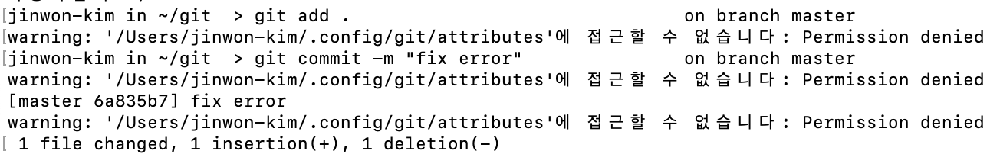

# MacOS 

# Git error handling

### 1. Permission Denied



> Mac OS 에 깃을 설치한 후에 git add . 등 각종 명령어를 입력하고 실행할 때 마다 이런 메시지가 나왔습니다.
>
> 구글 검색을 통해 [macOS: Permission denied auf ./config/git/attributes](https://blog.friedlandreas.net/2019/10/macos-permission-denied-auf-config-git-attributes/) 를 참조하였고, 아래 명령어로 해결 하였습니다.
>
> ```shell
> sudo chown -R 사용자명 .config 
> ```
>
> 이제 깔끔하게 명령을 입력하고, 출력을 확인하실 수 있습니다.

